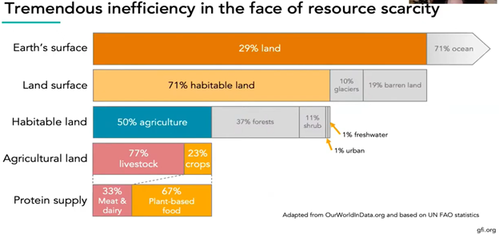
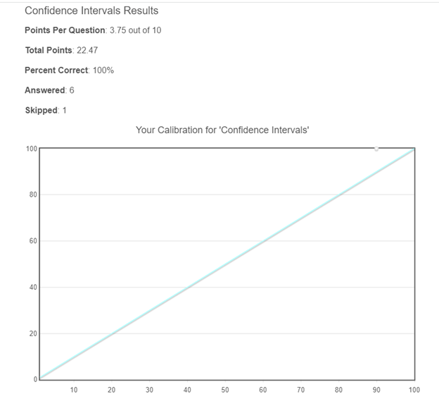

# Introductory Effective Altruism (EA)
Participant: Yogesh Kulkarni, Moderator: Pratik Agarwal

## Week 1: 5 Jan 2022

### Doing good Better - Introduction through Chapter 3
- merry-go-round play water pump, tank walls for advertisement (now dubbed as 1st world solution for 3rd world problem. Hand pump was better)
- became the center of a massive marketing campaign (Saw video, one guy did PhD on how this Solution failed)
- head-by applying data and reason to altruistic acts-we can turn our good intentions into astonishingly good outcomes.

### On Caring
- brain is simply incapable of scaling the care up by a billion times
- Our internal care-feelings are woefully inadequate for deciding how to act in a world with big problems.
- Giving all of your money away is just not what you do with money. 
- prominent altruists aren't the people who have a larger care-o-meter; they're the people who have learned not to trust their care-o-meters.
- Courage isn't about being fearless; it's about being able to do the right thing even if you're afraid.
- Found that seemingly obvious programs to improve education just weren't working. 
- De-worming (intestinal) helped as it reduced absenteeism. Cost-effective.

## Week 2: 12 Jan 2022

### Doing Good Better - Chapters 4 - 6 
- Diminishing returns also provides a powerful argument for focusing your altruistic efforts on people in poor countries rather than those in rich countries.
- do far more good working in a poor country than in a rich one. 100x multiplier.
- "Is this area neglected?" and trying to focus only on those areas that truly are neglected can be counterintuitive, but crucial.
- If you don't become a doctor, someone else will. Unless you are dramatically better than whoever will take the position, it's better to earn in a developed country and give to a developing country. rather than trying to maximize the direct impact you have with your job, you instead try to increase your earnings so you can donate more, improving people's lives through your giving rather than your day-to-day work.
- Thinking explicitly about expected value is important because humans are often terrible at assessing low-probability high-value events.
- We just need to assess the chances of success and how good success would be if it happened.

### One World Now Excerpt - Pages 174-178
- Victims (and non victims) got paid extravagantly during WTC collapse crisis
- Helping only own people is harming in directing help to the real needy

### Exercise: Generating quantitative estimates and comparing outcomes
- Part 1 - estimate your likely total future income
	- Profession: Teacher  till 60. Typical professor Income
- Part 2 - what could you achieve with your income?
	- 2a: what you could achieve if you donated 10% of your lifetime income to one of these charities
		- 10% can surely be used in donating to charities. It won't harm my lief-style.
	- 2b: which charity would you donate to to do the most good?
		- Currently donating to blind-girls-school. It serves 1 student for all educational expenses.

## Week 3: 19 Jan 2022

### Radical Empathy - Open Philanthropy Project
- US donors strongly prioritize people in their own country compared to people in the rest of the world.
- Main question: "Who deserves empathy and moral concern?"
- Answer: aspire to radical empathy: working hard to extend empathy to everyone it should be extended to, even when it is unusual or seems strange to do so.

### Moral Progress and Cause X
- We still haven't figured out all the moral problems yet, right from Aristotle. 
- Need to find that root Cause ('X') via Effective Altruism.

### All Animals Are Equal
- Thomas Taylor's analogy if humans are equal amongst themselves (men and women) then why not animals too?

### Exercise: Generating quantitative estimates and comparing outcomes
- Part 1 - A letter to the past (Personal aspects not related to any social, environmental issues)
	- My values/mental-make-up has more or less remained the same. INFJ personality. I would have suggested my past self to be a bit more confident (as there was enough backing !!)
	- I would suggest taking risk, which I did not do at 12th, but later, at 40 years, I did when I left my job to pursue further education.
- Part 2 - A letter from your future self  (Personal aspects not related to any social, environmental issues)
	- Take it easy buddy. Taking every responsibility of everything around should not be done. Basically, do your bit, and leave results to happen by themselves.
	- Take the 2nd plunge, more social service via work. Use skills for betterment. Now global impact is more attractive than yearly raises.
- Part 3 - Moral decision making [To be done in session] 
		
## Week 4: 26 Jan 2022

## The Precipice -  Introduction and Chapter 1 
- Our thinking range gets limited to recent events, but in reality, as a humanity, we have a long way to go.
- Future is at risk, we are at a precipice.

## What We Owe the Future
- Long Term-ism: for most good, it has to be long term, ie too long term
	- Future people matter, morally
	- There will be lot of people in future
	- Future people don't have a say, utterly disenfranchised/deprived
	- Possible to positively impact the very long run

## Exercise 1: 100 now or 2000 later
- Not clear if you don't save 100 now, will they die. If that's so, I will save 100 now. 
- "A bird in hand is better than 2 in the bush". 
- As 200 is beyond one human life range, 2000 doesn't matter.

## Exercise 2: Blind vs new children
- Will give eyesight to the blind, it's like a new life only.
- Not pay for new kids, as they can adopt and give, again, new life, to the less privileged

## Exercise 3: Future malaria patients
- Will be fine with me to use the donation for future generations as it is guaranteed to be useful.
		

## Week 5: 2 Feb 2022

## The Precipice, Chapter 2 - Existential Risk
- Saving Humanity from loss of civilization is our responsibility
- Even though others are spatially or temporarily away from us, we need to think about them and care for them, just the way our predecessors cared for us and left a livable earth.
- Aim is not to let humanity extinct and let its potential be realized by future generations.

## The Precipice, Chapter 4 - Anthropogenic Risks
- Various man-made decisions are likely to take humanity to extinction
- There were 3 occasions in which nuclear warfare was about to start
- Climate change, Environmental degradation, if not checked, have potential to ruin

## Policy and research ideas to reduce existential risk
- Control Engineered Pandemics, biological/chemical weapons
- Unaligned Artificial Intelligence
- Asteroids & Comets
- Super-volcanic Eruptions
- Nuclear Weapons
- Climate, environmental changes

## Week 6: 9 Feb 2022

### The Precipice -  Chapter 5 (pages 121-138) - Pandemics
- Predicting future technologies as well as future of technologies is hard. So are the risks.
- Plague pandemic in 1347 killed nearly 1/8th of the population that time. Now that world is more connected and dense, the risk is far higher. Evident in Covid case.
- Similar to biological weapons leakage hazard, information leak hazard is dangerous.

### The case for taking AI seriously as a threat to humanity 
- Narrow AI has seen extraordinary progress over the past few years. Narrow is becoming narrower, like GPT can predict only next word.
- AI growth is non linear. Suddenly it may become much smarter, AGI
- Danger is rooted in the fact that AI systems pursue their goals, whether or not those goals are what we really intended
- Nick Bostrom - "Once unfriendly super-intelligence exists, it would prevent us from replacing it or changing its preferences. Our fate would be sealed."

### How Students Will Lead the Alternative Protein Revolution
- Convert universities to powerhouse to generate alternate proteins
- Example: alternative to meat, for reducing Animal Suffering, Environmental Devastation, etc. Inefficient (9 energy calories as input to chicken to get 1 calorie of food)

	
	
- Student project: alt.protein

### Exercise - Calibrate Your Judgment
https://programs.clearerthinking.org/calibrate_your_judgment.html

	

### Exercise - Axioms of EA
- Everybody is equally valuable, irrespective of age, location, economic condition, etc. That's how the QALIS(??) get measured and they are given mosquito mats to save 100 folks in Africa rather than train a dog for an American blind. But then in the calculator, there are some assumptions where they consider remaining potential, right? So better to save a 20 year old young man than a 90 year old grandma. This feels contradictory to me!!
- One should maximize the expected value of one's actions in respect to a goal.

## Week 7: 16 Feb 2022

### The Logic of Effective Altruism 
- https://bostonreview.net/forum/peter-singer-logic-effective-altruism/
	- Effective altruism: we should do the most good we can
	- Living modestly and donating tenth of income to the most effective charities
	- Effective altruists do not discount suffering because it occurs far away or in another country or afflicts people of a different race or religion
- https://bostonreview.net/forum_response/response-daron-acemoglu/ 
	- Economic development is the best way to lift millions out of poverty and improve their health, education, and access to public amenities. Politics can, not EA.
	- Effective altruists' imperative to maximize their earnings so they can give more might influence what society views as a meaningful life.
- https://bostonreview.net/forum_response/response-peter-singer-reply/
	- Most respondents, however, worry that effective altruism overestimates its ability to identify the most effective interventions and achieve positive, long-term outcomes.
	- Effective altruists are likely to neglect the large-scale political and economic reform that would treat the causes, rather than the symptoms, of poverty

### Pascal's Mugging
https://www.nickbostrom.com/papers/pascal.pdf Dialog between Pascal and a mugger
- Pascal's approach: expected-Utility maximizer
- Sort of similar to quality-adjusted life year or quality-adjusted life-year (QALY)

### Common objections
https://www.effectivealtruism.org/faqs-criticism-objections
- Effective altruism focuses on improving lives (including those of humans, nonhuman animals, and people in future generations). 
- Even after paying our taxes, many of us find we still have plenty of capacity and desire to help people.
- You shouldn't put yourself in a bad situation in order to donate.

### Beware Systemic Change 
- https://web.archive.org/web/20200424075657/https://slatestarcodex.com/2015/09/22/beware-systemic-change/
	- Isn't "systemic change" (fighting inequitable laws or capitalism) better than EA?
	- "How can I best improve the world by giving it better policies?"
	- Better summary: "Not everything needs to be about systemic change."
- https://80000hours.org/2015/07/effective-altruists-love-systemic-change/
	- Contrary to misconception, that EA is ok for Systemic Change.
	- Most recent Open Philanthropy research and grants, on immigration reform, criminal justice reform, macroeconomics, and international development, are clearly focussed on huge structural changes of various kinds.
	- EA doesn't want to burn the existing system to the ground, but almost all of us want to make enduring improvements to national and international systems to ensure the future is better than the past. 

### Exercise
Biggest concerns about EA movement
	- Will this fly or remain just a cult. Vested interests (political and business) just don't care and do it on their own terms. You hear wonderful speeches from child activities at the environment summit and then?
	- Just appealing to the conscious in people won't help, there has to be something lucrative in the proposals to make it sustainable.

## Week 8: 23 Feb 2022

### Career Guide
https://80000hours.org/key-ideas/
- Your career is your biggest opportunity to make a difference, and how you can use it best
- ‘Making a difference' is best understood as being about the number of people whose lives you improve and how much you improve them by - regardless of who they are or when they're living.
- Some important issues get a lot less attention than others, so by focusing on these you can greatly increase your impact.
- Many social interventions don't have much impact; but the best are enormously effective.
- To have more impact, try to get in a position in which you can move more resources toward the best solutions.
- Personal fit is one of the most important factors in determining the expected impact of your career.
- Most people reach their peak productivity age 40-60, which suggests you can greatly increase your impact by investing in yourself.
- You should be able to find a career that's both much higher-impact and more satisfying than your default plan.

### Giving What we can
https://www.givingwhatwecan.org/about-us/
- Conceived of by Oxford philosopher Toby Ord.
- Now has 7,103 members, who have pledged to donate at least 10% of their income over the course of their careers,
- So far, members have donated more than $262,420,457 to charity and pledged to donate $2,713,498,346.

### Exercise
Reflection and plan
- Continue donating, to blind girls school, pandemic victims, from all the non-salary income I receive from courses, talks and teachings
- Continue to conduct AI training and awareness sessions, free and open to all.
- Scout for voluntary, global impact, AI project to contribute to.

